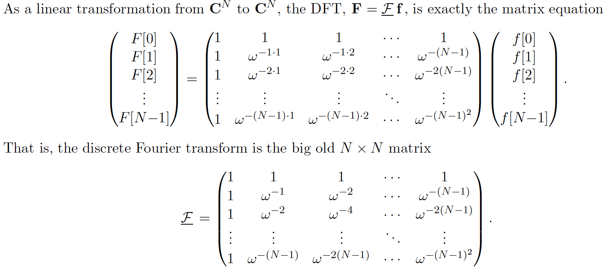

###Definition of discrete FT

$f(t)$ on $0<=t<=L$. then $\mathcal{F}f(s)$ on $0<s<2B$.

sample $f(t)$ at the rate $2B$ per second. so we have 

\begin{equation}
N=\frac{L}{1/2B}=2BL
\end{equation}

evenly spaced samples, at points:

\[t_0=0,t_1=\frac{1}{2B},\cdots,t_{N-1}=\frac{N-1}{2B}.
\]

We define a discrete version of $f(t)$ as $f_{discrete}(t)$

\[f_{discrete}(t)=f(t)\sum_{n=0}^{N-1}\delta(t-t_n)
\]

so the Fourier transform of $f_{discrete}$

\[\mathcal{F}f_{discrete}(s)=\sum_{n=0}^{N-1}f(t_n)\mathcal{F}\delta(t-t_n)=\sum_{n=0}^{N-1}f(t_n)e^{-2\pi ist_n}.
\]

For $\mathcal{F}f(s)$ the sampling in the frequency domain. Sampling rate is 1/L from 0 to 2B.

\[s_0=0,s_1=\frac{1}{L},\cdots,s_{N-1}=\frac{N-1}{L}.
\]

\[\mathcal{F}(s_m)=\sum_{n=0}^{N-1}f(t_n)e^{-2\pi i s_m t_n}
\]

one for each m from 0 to N-1 are supposed to be an approximation to the Fourier transform from $f(t)$ to $\mathcal{F}f(s)$.

\[\mathcal{F}f(s_m)=\frac{1}{2B}\mathcal{F}(s_m)
\]

###An operation accepts as input a list of N numbers and returns as output a list of N numbers

**Let $\mathbb{f}=(\mathbb{f}[0],\dotsc,\mathbb{f}[N-1])$ be an N-tupel. The DFT of $\mathbb{f}$ is the N-tuple $\mathbb{F}$, deifned by**

\[\mathbf{F}[m]=\sum_{n=0}^{N-1}\mathbf{f}[n]e^{-2pi i mn/N},\quad,m=0,1,\dotsc,N-1
\]

###Notation and convention 1

\[\omega_N=e^{2pi i/N}, \quad, \omega_N^N=1\]

###DFT in vector form
\[\underline{\mathcal{F}}\mathbf{f}=\sum_{k=0}^{N-1}\mathbf{f}[k]\omega^{-k}\]
The components of $\underline{\mathcal{F}}\mathbf{f}$ are the values of $\underline{\mathcal{F}}\mathbf{f}$ at the points $m=0,1,\dotsc,N-1$
\[\underline{\mathcal{F}}\mathbf{f}[m]=\sum_{k=0}^{N-1}\mathbf{f}[k]\omega^{-km}=\sum_{k=0}^{N-1}\mathbf{f}[k]e^{-2\pi ikm/N}\]

###DFT in matrix form

###When the spectrum is indexed form 0 to N-1, the convention is to day that the frequency from $m=1$ to $m=N/2-1$ are the positive frequencies, those from $m=N/2+1$ to $m=N-1$ are negative frequencies.

**for a real input $f$, all the information in the spectrum is in the components: $\underline{F}\mathbf{f}[0],...,\underline{F}\mathbf{f}[N/2-1]$, and the special value $\underline{F}\mathbf{f}[N/2]$.** The remaining components of $\underline{F}\mathbf{f}$ are just the complex conjugated of those from 1 to N/2-1.

###Two Grids
$N=2BL$
if $\delta t=1/2B$, the grid spacing in time, $\delta \nu$ is the grid spacing in the frequency domain.
$\frac{1}{N}=\delta t \delta \nu$.

For the problem that I have, I have $\delta x$ the spacing, and the $nx$ the number of measurements.

###Indexing and reindexing

####Notation and convention 1
N is assumed to be even and the index set for both the inputs $f$ and the outputs $F$ is taken to be $[-N/2+1:N/2]=[-N/2+1,...,0,...,N/2]$:
\[\underline{\mathcal{F}}f=\sum_{k=0N/2+1}^{N/2}f[k]w^{-k}
\]

thus we sample on the time interval from -L/2 to L/2 and on the frequency interval from -B to B.

####Here the frequency from $m=1$ to $m=N/2-1$ are the positive frequencies, those from $m=-N/2+1$ to $m=-1$ are negative frequencies which correspond to those of $m=N/2+1$ to $m=N-1$ in a index from 0 to N-1.